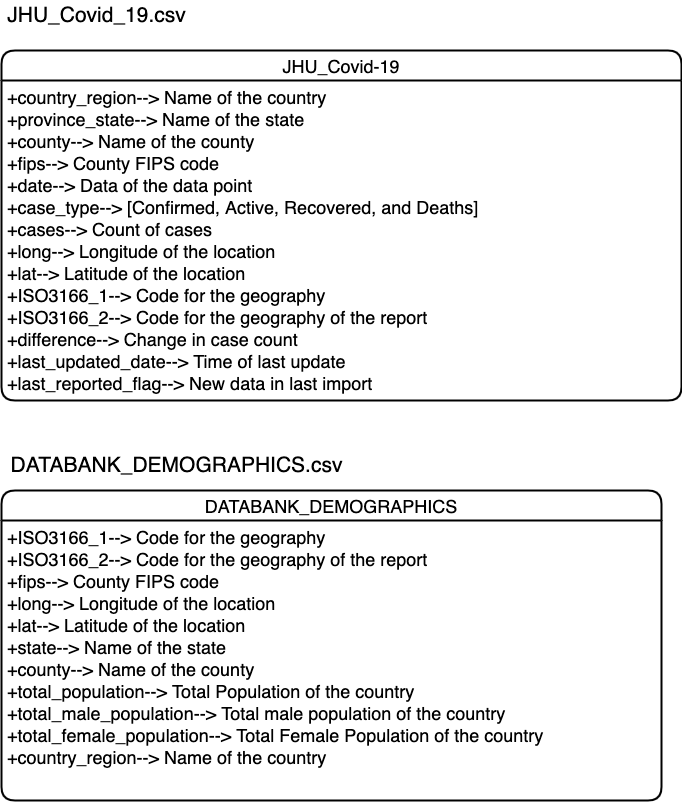
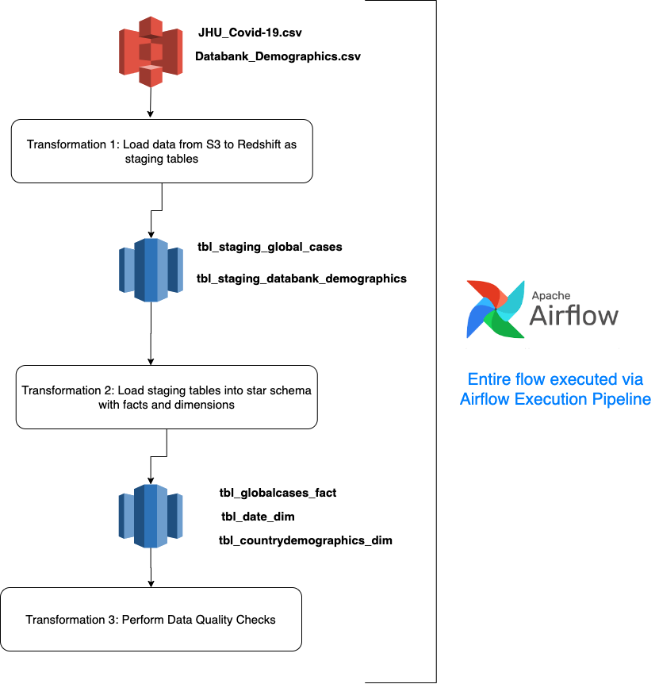
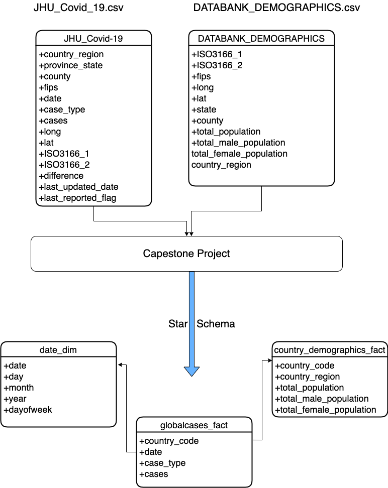
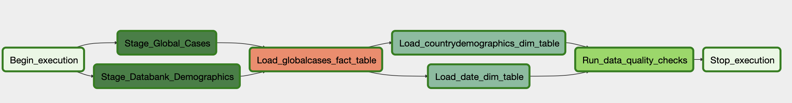
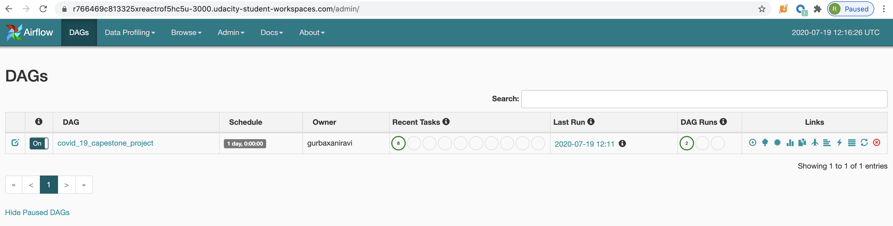
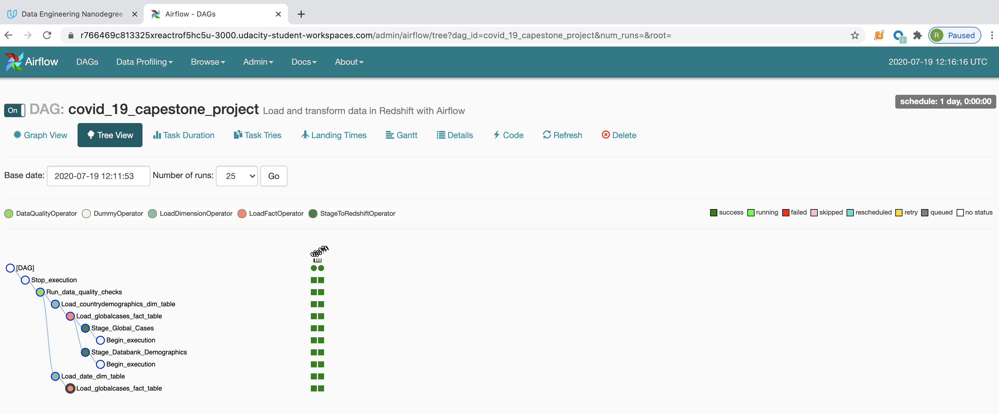

# Project: Covid-19 Data Analysis using Airflow, Redshift, AWS S3, and Python

## Introduction
The purpose of this data engineering capstone project is to apply what I have learned throughout the program. The project is an effort to showcase my skills on Data Warehousing Concepts and designing production grade Data and ETL pipelines

For this capestone project, have chosen the path to create open ended project. 

_**End Goal**: The end goal of this project is to extract data from Star Schema's Coivd-19 dataset and analyze how COVID-19 cases have been increasing/descrasing over the period of time. The data in the project contains COVID-19 cases count changes for the last 179 days_

## Project Description
The project is explained/documented as per Udacity's 5 step template below:

### Step 1: Scope of the project and Data Collection

The data for this project comes from the starschema's COVID-19 dataset and its desctiption can be found at:

***Dataset Homepage:*** https://starschema.github.io/COVID-19-data/ 
***Github Page:*** https://github.com/starschema/COVID-19-data 
***Data Used for this Project:*** [s3://starschema.covid/JHU_COVID-19.csv](https://s3-us-west-1.amazonaws.com/starschema.covid/JHU_COVID-19.csv) and 	[s3://starschema.covid/DATABANK_DEMOGRAPHICS.csv](https://s3-us-west-1.amazonaws.com/starschema.covid/DATABANK_DEMOGRAPHICS.csv)  
***JHU_COVID-19.csv (File Information):*** The file contains 1M+ records and has daily count of cases by country and case type i.e. Active, Confirmed, Recovered and Deaths 
***DATABANK_DEMOGRAPHICS.csv (File Information):*** The file contains demographics of the country namely population, male_population_female_population  

The Data Dictionary for the raw data used in the project is illustrated below:

  Scope of the project can be understood through the following illustration:  

### Step 2: Explore and Access the data
The goal of the project is really to view cases and changes in number of cases by country. The data presented two major issues:

***Issue 1***: For a lot of countries number of cases are on Country Level but for some coutries data is on County Level. There is a clear mismatch in granualrity of data 
***Fix***: When loading data to fact table all the data is now on the granularity level of Country

***Issue 2***: Data had lot of additional fields 
***Fix***: When moving data from staging to star schema, we are ignoring fields that are not needed

### Step 3: Define the data model
The entire data model along with its transformation can be found here:

### Step 4: Run ETL to Model the Data
We are using Apache Airflow for the same and the following screenshots depict the flow and success of the flow

  

  

  

#### Files in the repository
The project template includes three files:

<ins>**dags/covid_19_capestone.py**</ins> The file has the actual program i.e. Operators, Flows and Paramters 
<ins>**plugins/helpers/sql_queries.py**</ins> contains all the SQL queries used in this pipeline. Rest of the code is simply calling these SQLs 
<ins>**plugins/operators/stage_redshift.py**</ins> contains the operator logic for getting data from S3 locations and moving it to Redshift Staging tables 
<ins>**plugins/operators/load_fact.py**</ins> contains the operator logic for populating the Global Cases fact table from staging tables 
<ins>**plugins/operators/sql_dimension.py**</ins> contains the operator logic for populating the dimensions tables from staging tables 
<ins>**plugins/operators/data_quality.py**</ins> contains the operator logic for performing data quality checks 
<ins>**README.md**</ins> provides discussion on your process and decisions 

## Project Execution
The project is executed by following the steps below:

- Open Udacity workspace for the project
- Run /opt/airflow/start.sh
- Visit Airflow Web UI
- Turn on the button for the job, screenshot shows the same

### Step 5: Complete Project Write Up:
This step includes answers to some key questions: 

***Question 1***: What's the goal? What queries will you want to run? How would Spark or Airflow be incorporated? Why did you choose the model you chose? 
***Question 2***:Clearly state the rationale for the choice of tools and technologies for the project. 
***Explanation***:  
- The goal of the project is to build a star schema model where we can capture change in number of cases over the last 6 months 
- Queries like change in number of cases (Active, Recoveries, Deaths) on a daily basis or weekly basis or even monthly basis 
- For this particlar capestone have used Airflow and Python. Spark wans't really used because we were dealing with a million records in a single file, using Spark won't have given any advantage from parallelism perspective 
- Chose S3 because its great for object storage, Redhsift has all along been the choice of Data Warehouse, Airflow because its incredible at DAGs and Python because for limited data Python is good enough 

***Question 3***:Document the steps of the process. 
***Question 4***:Post your write-up and final data model in a GitHub repo. 
***Explanation***: 
Done as per the Udacity Curriculum instructions 

***Question 5***:Propose how often the data should be updated and why. 
***Explanation***: 
Change Data Capture will look like getting data from staging area and filtering data by today's date to capture delta. once delta is capture its all about appending the same to facts and dimension tables

***Question 5***:Include a description of how you would approach the problem differently under the following scenarios: 
If the data was increased by 100x. 
If the pipelines were run on a daily basis by 7am. 
If the database needed to be accessed by 100+ people. 
***Explanation***: 
If the data was increased by 100x.---> Would probably use Spark for reading data from S3 and instead of 2 node Redshift will increase the size of Redshift cluster 
If the pipelines were run on a daily basis by 7am.--> modify the project to capture only delta after initial load and then append the same to the table 
If the database needed to be accessed by 100+ people.--> Scale up Redshift as in when number of users accessing the database increase 

**Note**: It is assumed that you have already configured connections to Redshift and AWS S3

