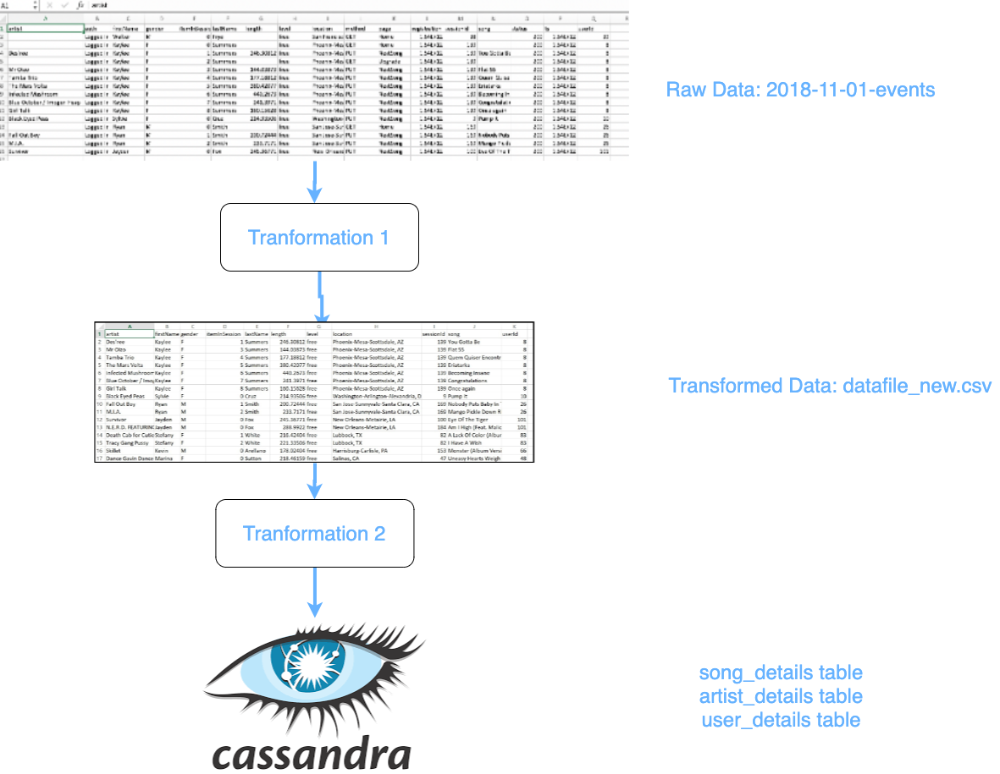

<b>Project: Data Modeling with Cassandra</b>

<b>Introduction:</b>
    
A startup called Sparkify wants to analyze the data they've been collecting on songs and user activity on their new music streaming app. There is no easy way to query the data to generate the results, since the data reside in a directory of CSV files on user activity on the app. My role is to create an Apache Cassandra database which can create queries on song play data to answer the questions.

<b>Project Overview:</b>

In this project, We would be applying Data Modeling with Apache Cassandra and complete an ETL pipeline using Python. We are provided with part of the ETL pipeline that transfers data from a set of CSV files within a directory to create a streamlined CSV file to model and insert data into Apache Cassandra tables.

<b>Datasets:</b>

For this project, you'll be working with one dataset: event_data. The directory of CSV files partitioned by date. Here are examples of filepaths to two files in the dataset:

event_data/2018-11-08-events.csv

event_data/2018-11-09-events.csv

<b>Visual Representation of the Project:</b>

