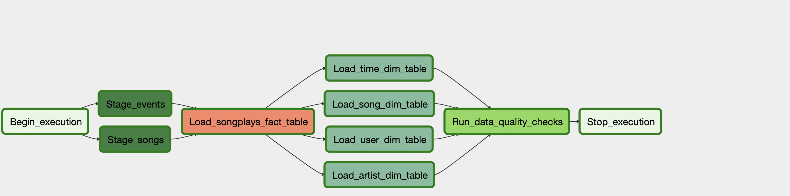
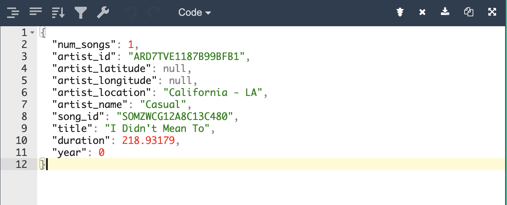
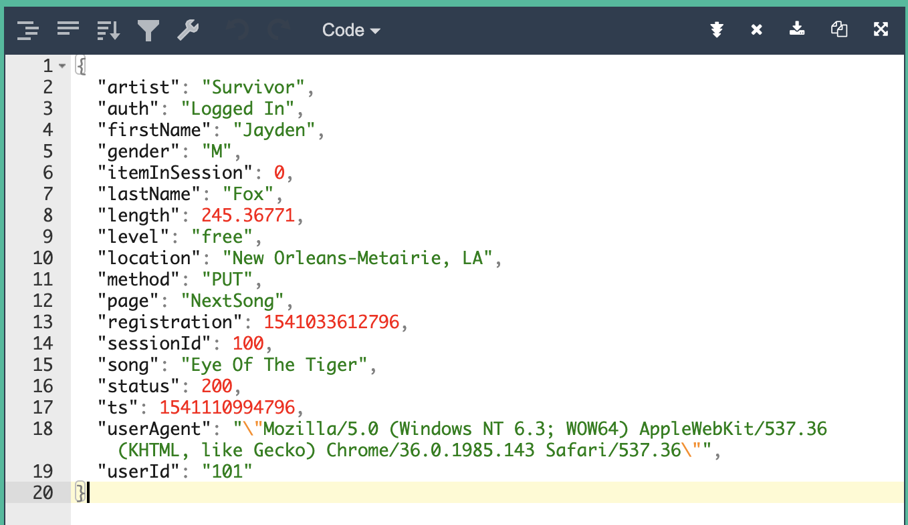
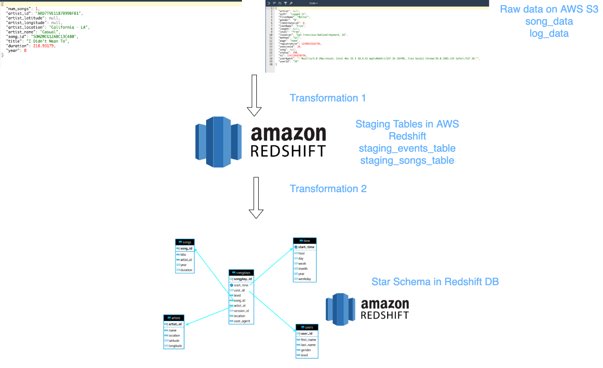
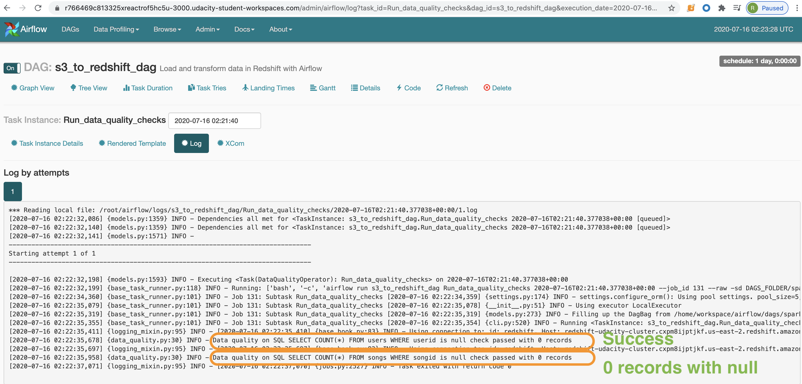
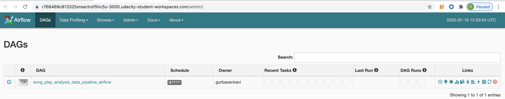

# Project: Data Pipelines with Airflow

## Introduction
A music streaming company, Sparkify, has decided that it is time to introduce more automation and monitoring to their data warehouse ETL pipelines and come to the conclusion that the best tool to achieve this is Apache Airflow.

They have decided to bring you into the project and expect you to create high grade data pipelines that are dynamic and built from reusable tasks, can be monitored, and allow easy backfills. They have also noted that the data quality plays a big part when analyses are executed on top the data warehouse and want to run tests against their datasets after the ETL steps have been executed to catch any discrepancies in the datasets.

The source data resides in S3 and needs to be processed in Sparkify's data warehouse in Amazon Redshift. The source datasets consist of JSON logs that tell about user activity in the application and JSON metadata about the songs the users listen to.

## Project Description
This project will introduce you to the core concepts of Apache Airflow. To complete the project, you will need to create your own custom operators to perform tasks such as staging the data, filling the data warehouse, and running checks on the data as the final step.

We have provided you with a project template that takes care of all the imports and provides four empty operators that need to be implemented into functional pieces of a data pipeline. The template also contains a set of tasks that need to be linked to achieve a coherent and sensible data flow within the pipeline.

You'll be provided with a helpers class that contains all the SQL transformations. Thus, you won't need to write the ETL yourselves, but you'll need to execute it with your custom operators.

# Project Datasets
You'll be working with two datasets that reside in S3. Here are the S3 links for each:

***Song data***: s3://udacity-dend/song_data 
***Log data***: s3://udacity-dend/log_data 
***Log data json path***: s3://udacity-dend/log_json_path.json

## Song Dataset

## Log Dataset

# Project Flow
The flow of the whole project can be summarized as [This whole flow has to be executed via Airflow Data Pipeline]   

# End goal of the project

At the end of the project we should ideally have a data model that looks like    

And the final output from Airflow should look like   

## Files in the repository
The project template includes three files:

<ins>**dags/sparkify_airflow_dag.py**</ins> The file has the actual program i.e. Operators, Flows and Paramters 
<ins>**plugins/helpers/sql_queries.py**</ins> contains all the SQL queries used in this pipeline. Rest of the code is simply calling these SQLs 
<ins>**plugins/operators/stage_redshift.py**</ins> contains the operator logic for getting data from S3 locations and moving it to Redshift Staging tables 
<ins>**plugins/operators/load_fact.py**</ins> contains the operator logic for populating the Songplays fact table from staging tables 
<ins>**plugins/operators/sql_dimension.py**</ins> contains the operator logic for populating the dimensions tables from staging tables 
<ins>**plugins/operators/data_quality.py**</ins> contains the operator logic for performing data quality checks 
<ins>**README.md**</ins> provides discussion on your process and decisions 

## Project Execution
The project is executed by following the steps below:

- Open Udacity workspace for the project
- Run /opt/airflow/start.sh
- Visit Airflow Web UI
- Turn on the button for the job, screenshot shows the same

**Note**: It is assumed that you have already configured connections to Redshift and AWS S3

