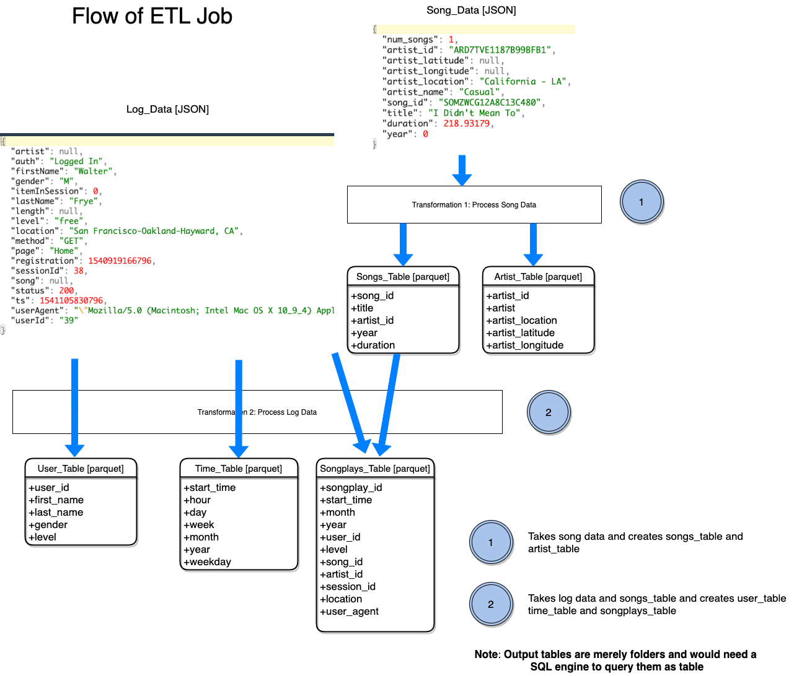

# Project: Data Lake
## Introduction
A music streaming startup, Sparkify, has grown their user base and song database even more and want to move their data warehouse to a data lake. Their data resides in S3, in a directory of JSON logs on user activity on the app, as well as a directory with JSON metadata on the songs in their app.

As their data engineer, you are tasked with building an ETL pipeline that extracts their data from S3, processes them using Spark, and loads the data back into S3 as a set of dimensional tables. This will allow their analytics team to continue finding insights in what songs their users are listening to.

You'll be able to test your database and ETL pipeline by running queries given to you by the analytics team from Sparkify and compare your results with their expected results.

## Project Description
In this project, you'll apply what you've learned on Spark and data lakes to build an ETL pipeline for a data lake hosted on S3. To complete the project, you will need to load data from S3, process the data into analytics tables using Spark, and load them back into S3. You'll deploy this Spark process on a cluster using AWS.

## Project Datasets
You'll be working with two datasets that reside in S3. Here are the S3 links for each:

**Song data:** s3://udacity-dend/song_data  
**Log data:** s3://udacity-dend/log_data

## Project Flow
The diagram below depicts the project flow:

## ERD after successful execution of the Project
The diagram below depicts the ERD would appear after project is successfully executed:

## Files in the repository
The project template includes three files:

**etl.py** reads data from S3, processes that data using Spark, and writes them back to S3 
**dl.cfgcontains** your AWS credentials. This file is not checked in as it contains AWS keys, but the format of the file is as follows 
<pre><code>[AWS]
AWS_ACCESS_KEY_ID= 
AWS_SECRET_ACCESS_KEY=</code></pre>
**README.md** provides discussion on your process and decisions 

## Project Execution
The project is executed with the following command

<pre><code>spark-submit --master yarn etl.py</code></pre>

**Note**: The project assumes you have a perfectly well setup Hadoop cluster with Spark Up and Running. The cluster could be EMR, Cloudera, Databricks HDInsight or Dataproc. 
Also the project assumes dl.cfg is the current path
