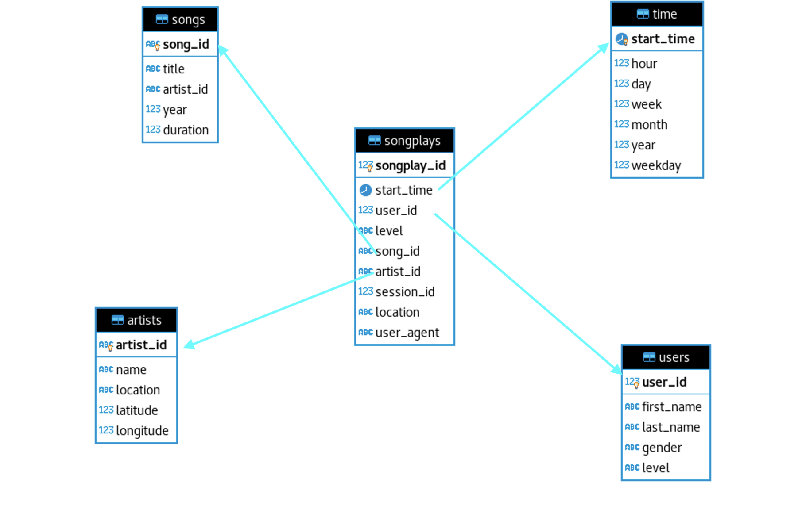
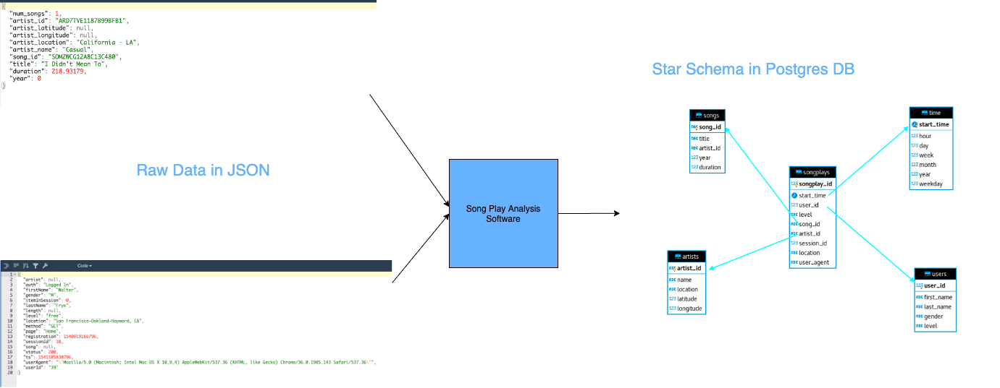
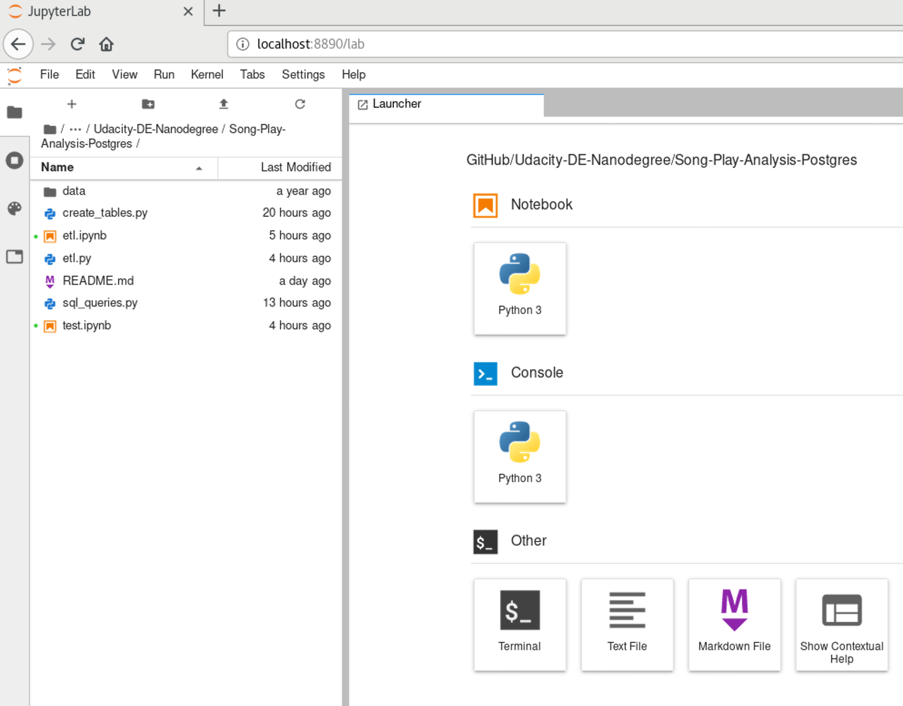

# Project: Data Modeling with Postgres
### Introduction
A startup called Sparkify wants to analyze the data they've been collecting on songs and user activity on their new music streaming app. The analytics team is particularly interested in understanding what songs users are listening to. Currently, they don't have an easy way to query their data, which resides in a directory of JSON logs on user activity on the app, as well as a directory with JSON metadata on the songs in their app.

They'd like a data engineer to create a Postgres database with tables designed to optimize queries on song play analysis, and bring you on the project. Your role is to create a database schema and ETL pipeline for this analysis. You'll be able to test your database and ETL pipeline by running queries given to you by the analytics team from Sparkify and compare your results with their expected results.

Project Description
In this project, you'll apply what you've learned on data modeling with Postgres and build an ETL pipeline using Python. To complete the project, you will need to define fact and dimension tables for a star schema for a particular analytic focus, and write an ETL pipeline that transfers data from files in two local directories into these tables in Postgres using Python and SQL.

### Scenario and End goal of the project
Currently the team has two datasets both in JSON form

#### Dataset 1: Song Data
Song Data JSON looks like:

#### Dataset 2: Log Data
Log Data JSON looks like:

#### Final Goal 
Final goal of the project is to create a star schema based Data Warehouse in Postgres. The star schema will look like

### Visual Representation of the Project

### Purpose of each file

The solution file structure looks like

***test.ipynb*** displays the first few rows of each table to let you check your database.

***create_tables.py*** drops and creates your tables. You run this file to reset your tables before each time you run your ETL scripts.

***etl.ipynb*** reads and processes a single file from song_data and log_data and loads the data into your tables. This notebook contains detailed instructions on the ETL process for each of the tables.

***etl.py*** reads and processes files from song_data and log_data and loads them into your tables. You can fill this out based on your work in the ETL notebook.

***sql_queries.py*** contains all your sql queries, and is imported into the last three files above.

***README.md*** provides discussion on your project.
